# Wireboy.Socket.P2PSocket

这是一个使用.NetCore控制台项目作为服务端，.netframework4.5的C#控制台项目作为主控与被控客户端的项目。

喜欢此项目的，请点击一下右上角的Star

加入QQ群417159195，与作者共同交流，入群途径请填写“P2PSocket”

## 你好，程序员们

1.无论你对当前项目有什么建议或者发现了什么BUG，欢迎提出来，在Issue和QQ群都可以。

2.如果有能力，欢迎大家创建分支，然后提交代码，感谢大家。

3.对于任何建议、BUG反馈、分支代码提交等等与本项目互动的动作，我都会尽快回复，不会置之不理的。

## 这个项目能做些什么？

1.类似花生壳，将内网网站部署到公网（前提是有一台公网服务器部署P2PServer项目）

2.2个不同内网的电脑，使用mstsc直连或者teamview进行远程控制

3.基于http协议的2级域名转发

## 当前项目状态？

1.master分支版本作为稳定版本。

2.dev分支版本为开发者活跃版本，新功能在dev版本稳定后，会与master分支合并。

## 网络结构

### 内网穿透结构

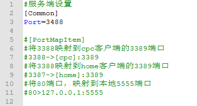

### http服务结构

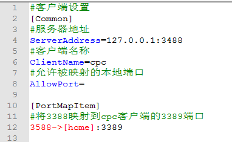

## 例子：mstsc远程控制（3端）

介绍：mstsc服务在远程连接时，使用3389端口，所以只需要将数据转发到3389端口即可实现mstsc的内网穿透

1.服务器配置

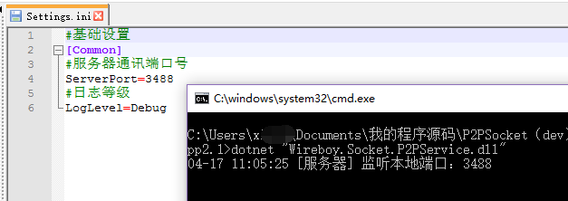

2.开启配置远程服务

3.被远程电脑配置

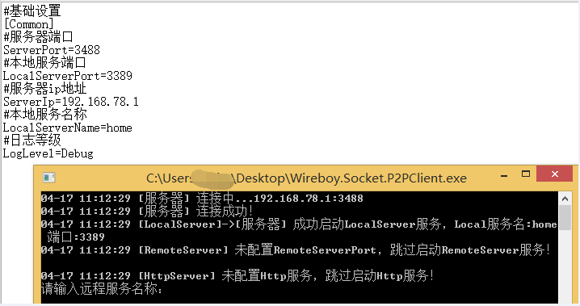

4.本机电脑配置

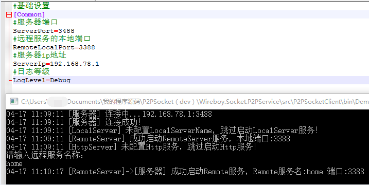

## 例子：teamview远程控制（3端）

介绍：teamview服务在使用Lan远程时，使用5938端口，所以只需要将数据转发到5938端口即可实现teamview的内网穿透，且Lan连接不限制商业用途

注意：在主控端电脑，需要在任务管理器关闭Teamview，启动P2PClient后再开启Teamview，因为P2PClient需要监听5938端口，如果先启动Teamview，P2PClient将无法监听5938端口，导致连接失败！

1.P2PServer配置

3.配置被远程电脑Teamview

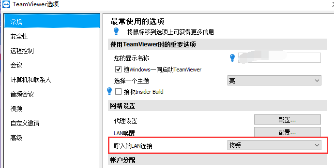

4.被远程电脑P2PClient配置

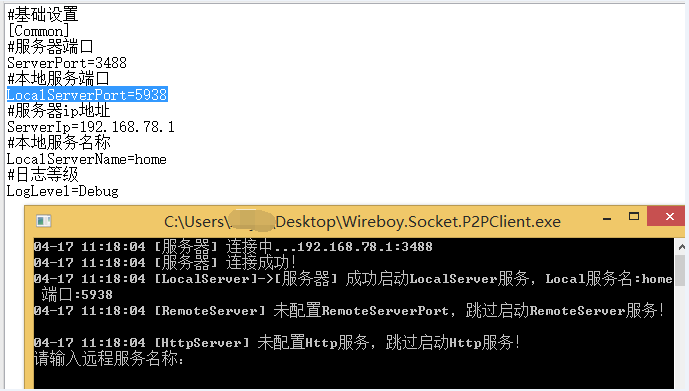

5.本机电脑P2PClient配置

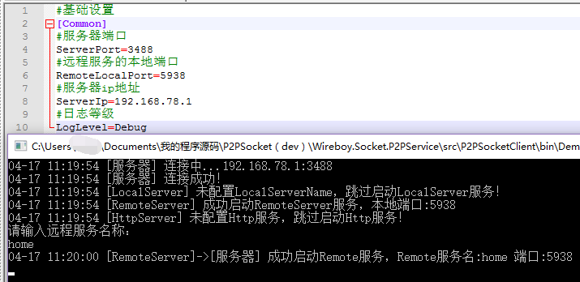

## 例子：Http内网穿透之一对一关系配置（2端）

介绍：将连接到服务器1706端口的www.star110.com请求转发到内网

1.P2PServer配置

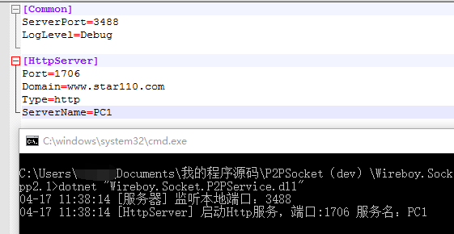

2.PC1的P2PClient配置

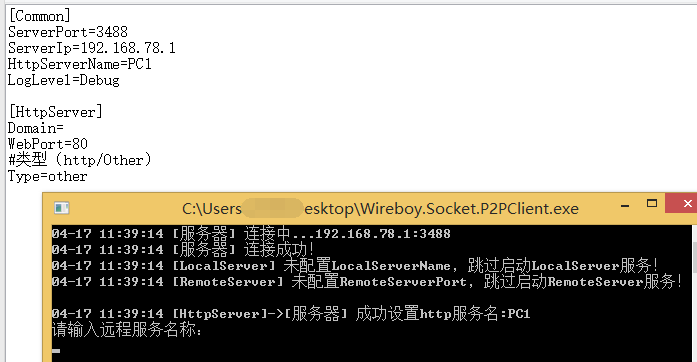

## 例子：Http内网穿透之多对一关系配置（2端）

介绍：将连接到服务器1706端口的www.star110.com和blog.star110.com请求分别转发到内网PC1电脑的80和81端口

1.P2PServer配置

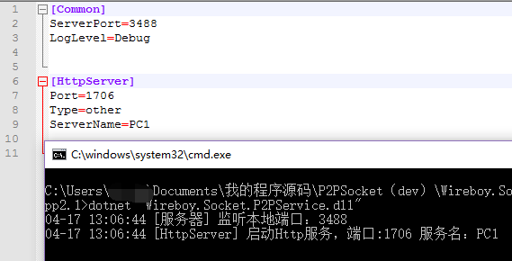

2.P2PClient配置

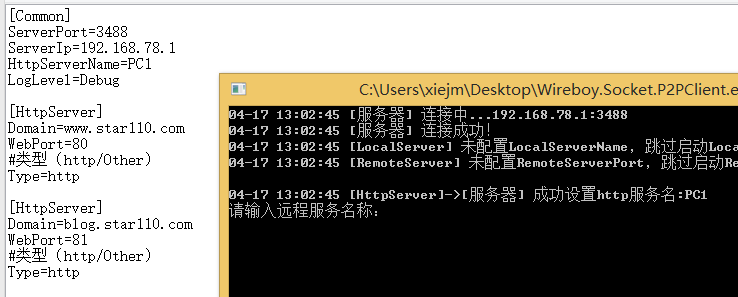

## 例子：Socket转发/Https转发（2端）

介绍：将所有发送到服务器xxx端口的数据，直接转发到相应Client客户端，再通过client转发到本地xxx端口

1.P2PServer配置

2.P2PClient配置

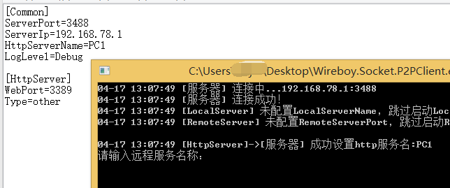

## 更新日志

### 2019年4月13日

1.修改了服务器与客户端的通讯协议（不与原程序兼容，更新时需要服务器与客户端同时更新）

2.修改日志等级（原配置文件的日志等级值：Error、Info、Debug、Trace）

### 2019年4月11日

1.Home服务改名称Local服务，Client服务改名称Remote服务

2.优化启动方式，除了Remote服务，其它服务均按照配置文件自动启用

3.同步控制台输出与日志文件输出，且控制台输出改为异步，避免程序卡住

4.修复传输10M以上文件会报错的问题

5.优化代码，程序稳定性有较大的提升

### 2019年3月27日

1.增加Http请求转发

2.增加二级域名配置

3.增加TCP端口复用功能

### 2019年3月20日

1.优化数据包处理逻辑，提高代码效率和美观

2.新增双工模式（同一电脑，主控与被控服务可同时开启）

3.解决第一次连接断开后，第二次连接必失败，需要第三次连接的问题

### 2019年3月15日

1.原Home服务端与原Client服务端合并

2.客户端完善断线重连功能，主控、被控与服务器可乱序启动

3.增加配置文件的读写

4.增加日志的读写

5.修复使用mstsc连接失败的问题

### 2019年2月20日

1.解决第二次连接失败的问题

2.增加被控端（Home）的日志记录功能

