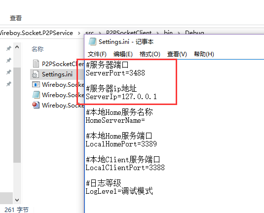
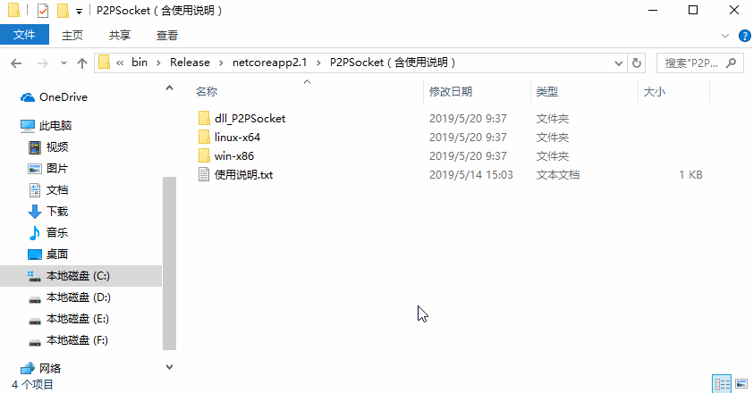
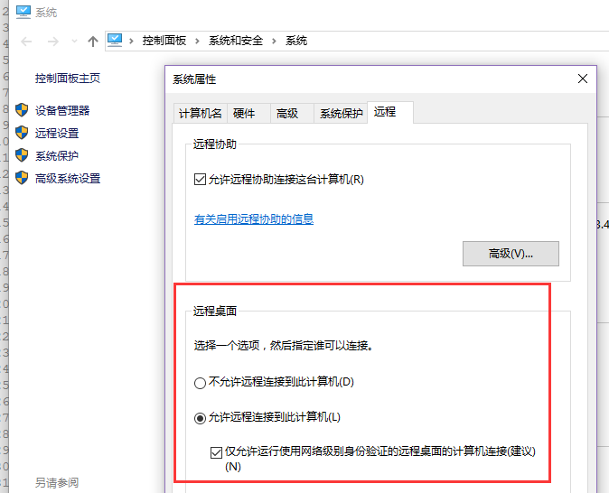
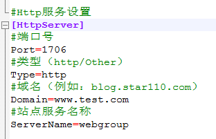

# Wireboy.Socket.P2PSocket

这是一个跨平台的项目，支持Windows、Linux、树莓派等操作系统，开发环境：.Net Core2.1

喜欢此项目的，请点击一下右上角的Star

有任何问题，加入QQ群417159195，与作者共同交流，入群途径请填写“P2PSocket”，欢迎大家入群后给群主发红包~

## 你好，程序员们

1.无论你对当前项目有什么建议或者发现了什么BUG，欢迎提出来，在Issue和QQ群都可以。

2.如果有能力，欢迎大家创建分支，然后提交代码，感谢大家。

3.对于任何建议、BUG反馈、分支代码提交等等与本项目互动的动作，我都会尽快回复，不会置之不理的。

## 这个项目能做些什么？

1.类似花生壳，将内网网站、数据库、svn等等应用部署到公网

2.不同内网的2台电脑，使用mstsc或者teamview进行远程控制

## 当前项目状态？

1.master分支版本作为稳定版本。

2.dev分支版本为开发者活跃版本，dev版本稳定后，将与master分支合并。

## 视频教程

1. [P2PSocket如何编译可执行文件](https://www.bilibili.com/video/BV1ue41147p1/)

2. [简单使用P2PSocket进行远程桌面](https://www.bilibili.com/video/BV1XE411K7ca/)

## 网络结构

### 内网穿透结构

## 使用方法

1.编译项目StartUp项目.

2.编译项目P2PServer与P2PClient.

3.linux系统，输入dotnet StartUp.dll启动。windows系统双击StartUp.exe启动

说明：

1.P2PServer与P2PClient是standard2.0项目，可直接复制到linux-x64/P2PSocket或者win-x86/P2PSocekt目录下使用.

2.StartUp在启动时，通过动态加载dll启动P2PSocket目录下的服务端或客户端（先服务端后客户端）.

3.如果手动编译，需要在StartUp.dll当前目录中，新建P2PSocket目录，将客户端或者服务端dll复制进去。

## 配置文件说明 -> [点此查看](https://github.com/bobowire/Wireboy.Socket.P2PSocket/wiki)

## 例子：mstsc远程控制（3端）

介绍：mstsc服务在远程连接时，使用3389端口，所以只需要将数据转发到3389端口即可实现mstsc的内网穿透

1.被控制端mstsc设置

2.服务端Server配置

3.主控制端Client配置

4.被控制端Client配置

5.在主控端启动mstsc，输入127.0.0.1:3588即可

6.效果图

## 更新日志

### 2020年2月20日 - 3.0.0版本发布

1.新增P2P打洞模式，不再通过服务器中转数据

2.增加配置文件重载

### 2019年9月5日 - 增加身份认证

1.增加客户端授权（支持"无限制"、"客户端名称"、"客户端名称+授权码"3种模式）

2.增加端口授权（支持“端口”（无限制）、“端口+指定客户端”）

3.AllowPort增加设置端口范围

4.完善日志记录

注意：由于协议升级，需要同时更新客户端与服务端

### 2019年5月13日 - 2.0版本全新发布

1.通讯tcp连接与内网穿透数据tcp分离

2.新增本地电脑->目标电脑多端口映射

3.适应多种场景：

	1）在DMZ主机映射内网端口：单独运行P2PServer或者单独运行P2PClient即可将DMZ主机多个端口映射到内网指定ip的端口
	
	2）不同内网的电脑端口映射：在公网服务器运行P2PServer，在不同内网电脑上，运行P2PClient
	
	3）将公网服务器端口映射到其它内网电脑端口：在公网服务器运行P2PServer，在内网电脑运行P2PClient
	
4.移除Http的二级域名转发支持，有需要的可以搭配nginx使用。

### 2019年4月13日

1.修改了服务器与客户端的通讯协议（不与原程序兼容，更新时需要服务器与客户端同时更新）

2.修改日志等级（原配置文件的日志等级值：Error、Info、Debug、Trace）

### 2019年4月11日

1.Home服务改名称Local服务，Client服务改名称Remote服务

2.优化启动方式，除了Remote服务，其它服务均按照配置文件自动启用

3.同步控制台输出与日志文件输出，且控制台输出改为异步，避免程序卡住

4.修复传输10M以上文件会报错的问题

5.优化代码，程序稳定性有较大的提升

### 2019年3月27日

1.增加Http请求转发

2.增加二级域名配置

3.增加TCP端口复用功能

### 2019年3月20日

1.优化数据包处理逻辑，提高代码效率和美观

2.新增双工模式（同一电脑，主控与被控服务可同时开启）

3.解决第一次连接断开后，第二次连接必失败，需要第三次连接的问题

### 2019年3月15日

1.原Home服务端与原Client服务端合并

2.客户端完善断线重连功能，主控、被控与服务器可乱序启动

3.增加配置文件的读写

4.增加日志的读写

5.修复使用mstsc连接失败的问题

### 2019年2月20日

1.解决第二次连接失败的问题

2.增加被控端（Home）的日志记录功能

