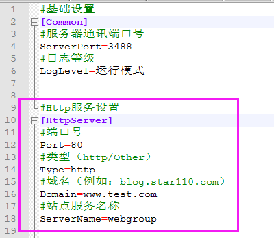
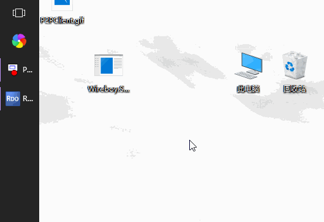

# Wireboy.Socket.P2PSocket

喜欢此项目的，请点击一下右上角的Star

加入QQ群417159195，与作者共同交流，入群途径请填写“P2PSocket”

## 已支持功能

1.安全的暴露内网服务

2.http请求转发

3.二级域名配置

4.TCP端口复用

## 开发计划（开发顺序不分先后）

（已完成）~~1.客户端与服务端均增加日志功能~~

（已完成）~~2.客户端（主控端）增加断线重连功能~~

（已完成）~~3.为客户端与服务端增加配置文件~~

4.TCP点对点连接（不经过服务器）

5.客户端（被控端）增加密码验证

6.服务端增加用户名与密码验证（数据库）

## 当前项目状态？

1.master分支版本已稳定，但需要修改服务端ip编译后使用。

2.dev分支版本为开发者活跃版本，新功能会先加入dev分支，稳定后与master分支合并。

## 网络结构

## 先来个项目介绍吧

此项目在正确设置服务端ip后，可用于mstsc进行远程桌面控制（我的目的也如此）。

这是一个使用.NetCore控制台项目作为服务端，.netframework4.5的C#控制台项目作为主控与被控客户端的项目。

结论：这是一个假的p2p服务

## 安全的暴露内网服务
	
	A：公网服务器  B：提供服务的服务器  C：用户电脑
	
	1.在A中，修改P2PService服务的配置文件，设置要开启的端口号（ServerPort，例如：3488）
	
	2.在B中，修改P2PClient服务的配置文件，设置服务器ip（ServerIp，例如：127.0.0.1）、服务器端口（ServerPort，例如：3488）与 本地Home服务端口（LocalHomePort，例如：3389）
	
	3.在A中，启动P2PService服务
	
	4.在B中，启动P2PClient服务，在控制台选择“启动被控端”，根据提示输入本地服务名称（例如：webServer）
	
	5.在C中，修改P2PClient服务的配置文件，设置服务器ip（ServerIp，例如：127.0.0.1）、服务器端口（ServerPort，例如：3488）与本地Client服务端口（LocalClientPort，例如：3388）
	
	6.在C中，启动P2PClient服务，在控制台选择“启动主控端”，根据提示输入远程服务名称（例如：webServer）
	
	7.在C中，连接127.0.0.1:3388等同于连接B中的127.0.0.1:3389

## http内网穿透

	A：公网服务器  B：提供服务的服务器
	
	1.在A中，修改P2PService服务的配置文件，设置要开启的端口号（ServerPort，例如：80），并添加以下代码，如下图：
	
	
	
	2.在B中，修改P2PClient服务的配置文件，设置本地Http服务名称（HttpServerName，例如：webGroup），并添加以下代码，如下图：
	
	
	
	3.在A中启动P2PService，在B中启动P2PClient
	
	
###	注意：
	
		1）P2PClient与P2PService均支持同端口不同域名的转发，且支持二级域名，但是需要将紫色框中的配置完整复制。
		
		2）https连接可以将Type设置为Other，但是同一个端口仅允许设置一个https转发
		
### http内网穿透网络结构

## 范例：远程桌面内网电脑？

编译环境：VS2017 + .Net Framework 4.5  + .Net Core 2.1

1.修改Wireboy.Socket.P2PClient.exe的配置文件，将服务器ip与端口改为自己的公网ip服务器。

2.在公网ip服务器部署并启动Wireboy.Socket.P2PService.dll。（手动启动：在控制台输入 dotnet Wireboy.Socket.P2PService.dll）

3.将Wireboy.Socket.P2PClient.exe在被控制电脑启动，输入本地Home服务名称：home

4.将Wireboy.Socket.P2PClient.exe在主控电脑启动，输入远程Home服务名称：home

5.在主控电脑，启动mstsc，输入127.0.0.1:3388 进行远程连接

注：被控端电脑需要开启远程服务，如下图：

## 运行效果图

## 更新日志

### 2019年3月20日

1.优化数据包处理逻辑，提高代码效率和美观

2.新增双工模式（同一电脑，主控与被控服务可同时开启）

3.解决第一次连接断开后，第二次连接必失败，需要第三次连接的问题

### 2019年3月15日

1.原Home服务端与原Client服务端合并

2.客户端完善断线重连功能，主控、被控与服务器可乱序启动

3.增加配置文件的读写

4.增加日志的读写

5.修复使用mstsc连接失败的问题

### 2019年2月20日

1.解决第二次连接失败的问题

2.增加被控端（Home）的日志记录功能

